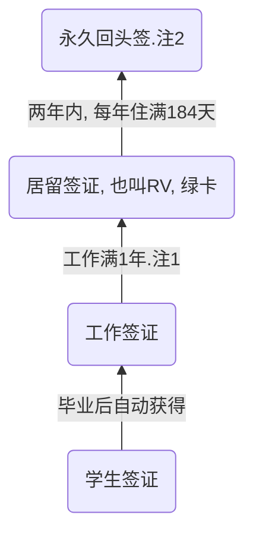

# 移民知识汇总

## 前言

1. 本文旨在从一下几个方面, 阐述移民知识. 期待的阅读受众限于我的家庭成员.
2. 为了方便阅读, 我尽量用简洁的语言进行描述, 适当的配以图示, 并且适当的加入类比, 以方便对新事物的理解.
3. 本文内容出自我个人的理解, 难免有失偏颇, 我尽力把事实与我的个人感受分开来说.
4. 牵扯到宏观政策问题, 文中部分内容具有很强的时效性, 如有必要, 我再根据政策变动来更新.
5. 本文初稿写于2023年6月23日.

* 基础问题扫盲
* 选择移民的原因
* 行动计划以及关键时间节点
* 后续规划

## 基础问题扫盲

* **问: 什么是护照?**
  答: 护照是中国人出入国境和再国外证明国籍和身份的证件. 类似于国内通用的身份证.

* **问: 什么是签证?**
  答: 签证是目的地国家颁发的证件, 表示允许你出入该国家.
  *这个允许是有诸多类型的, 最常见的类型有:*
  *1. 拒签, 表示不允许*
  *2. 旅游签, 表示只允许去旅游, 不允许工作*
  *3. 工作签, 表示允许工作, 纳税, 此时通常享有一定的纳税人权利*
  *4. 学生签, 表示允许留学*
  *5. 居留签, 通常说的绿卡, 表示可以没有任何限制的居留, 工作/旅游/上学干什么都行, 可以选举, 享受完全一样的福利待遇*

* **问: 通常说的福利待遇具体是什么?**
  答: 西方国家和中国有太多不同点. 每个人看重的点不一样, 也造成了对这个问题的理解不一样. 以下是我的个人认为重要的方面:
  *1. 房子便宜. 当然这个是相对来说便宜. 250万-300万人民币可以购置一套独立别墅.*
  *2. 社会保障. 上学, 医疗, 养老全部免费. 当然也有付费的(私立学校/私立医院/额外购买的养老保险), 付费享受的服务肯定比免费的更好.*
  *3. 自然环境. 单说一个空气污染, 这个是肉眼可见的*
  *4. 工作轻松. 几乎没有加班, 超多的假期(带薪病假2周, 带薪年假4周, 其他产假什么之类的就更多)*

* **问: 养老/退休是怎样的?**
  答: 根据目前的政策, 领取养老金主要需要满足2个条件:
  *1. 年满65周岁*
  *2. 在新西兰住满10年*
  养老金的金额是全社会无差别的(跟收入/财产/纳税/社会地位全部无关), 目前大约是$480/周.

* **问: 小孩上学是怎样的?**
  答: 这里也有学区的概念. 不同阶段上学是不一样的.
  *1. 托儿所(6个月-3岁). 收费. 一般产假结束后, 6个月就送托儿所*
  *2. 学前班(3-6岁). 免费20小时/周. 如果需要更多时间在幼儿园, 需要额外付费*
  *3. 小学中学(1-12年级). 免费*
  *4. 大学. 收费(这个还太远, 暂时不讨论)*
  如果家庭住址被某学区覆盖, 则直接去上学没有问题. 如果没有被学区覆盖, 也可以报名, 但是非优先处理.
  **所以考虑小孩上学的问题的话, 还是要考虑学区房**

* **货币怎么算?**
  答: 这里通用的是新西兰元, 也叫纽币(不叫新币, 新币是指新加坡的货币). 与人民币兑换大约是1纽币≈4.5人民币. 可以在银行直接兑换.
  带有周期性质的基本都是按照周为单位. 例如: 工资/房租/贷款等.

* **消费水平?**
  答: 以我个人为例
  *1. 住. 这是大头. 我目前租的三室一厅其中最小的一间, 130/周. 我同学一家三口整租的四室一厅, 590/周*
  *买房子的话, 假设贷款50万, 则还款713/周*
  *2. 食. 在外面吃大约15-20/餐. 自己做饭的话 100/周肯定够了*
  *3. 行. 我目前平均1000公里/月, 油钱大约 35/周*
  *4. 衣. 我还没在这买过衣服. 这个衣服价格上下差挺多的, 就不做统计了*
  *5. 其他. 这都是月为单位. 电话费 15/水费 免费/电费 50/煤气 不通煤气/物业费 免费*
  总体而言, 我现在每个月的开销在1000左右. 一家三口的话, 合理推测在3000-4000范围.

* **收入水平?**
  答: 法定最低收入大约税后20/小时, 即800/周, 3200/月(一个人全职工作, 基本可以覆盖一家三口).
  工资中位数大约 30/小时, 即1200/周, 4800/月.(中位数大概可以理解为所有人的平均工资)(**办理移民要达公子必须达到中位数, 即我毕业以后的工资, 肯定不低于这个数**)

## 选择移民的原因

这个问题跟上面说的福利待遇基本重合. 我看重的福利待遇, 其他很大程度上就是原因. 有些因素是亲身经历的事实, 有些因素是发生在别人身上但尚未发生在自己身上的事, 有些因素是尚未发生的个人推断. 这里我只说确实已经发生的事.

1. 住房. 南京这个两室的小房子, 是在两家父母出钱的基础上, 才有可能买到的. 92平方米(室内可用面积约70平), 现在住了三代人, 非常拥挤, 加剧了家庭内部的摩擦, 还有左邻右舍楼上楼下邻里的影响. 另外小孩随着年龄长大也需要一定的私人空间. 而差不多的价格, 在这边能买到什么呢? 一亩地的院子, 宽敞的房间.
2. 教育. 国内虽然一再强调减负, 但是宏观问题是教育资源不够(并且严重不平衡), 中考/高考的问题没法彻底解决. 这边的教育资源是足够的, 没有升学压力, 孩子要轻松不少.
3. 人际关系. 以我这段时间的感受, 跟之前我从网上的了解一样, 人际关系简单, 人与人之间和善, 谦恭, 包容. 没有应酬, 没有什么走后门, 塞红包这些人人都知道不对, 但是人人都要做的事.
4. 自然环境. 没有空气污染, 水污染.

## 行动计划及关键时间节点

*注1: 这是最关键的一步. 工作签证有时间限制(一般两年/三年), 而居留签证是永久有效. 达成这一步的政策在不断变化中, 按照目前已知的政策, 我需要工作满1年即可申请获得*
*注2: 这个是最终目标. 拿到这个签证之后, 可以到任意国家居住任意时常, 随时都可以返回新西兰*

## 后续规划

1. 在目前可预见的未来, 毕业肯定没有问题. 工作合同大概没有问题(留在我当前工作的公司). 拿绿卡只是时间问题.
2. 我毕业工作落实之后, 配偶和孩子即可过来生活.
3. 拿到居留签证之后, 可以买房子.
4. 父母可以持旅游签证过来, 每年停留半年.
5. 后续可以给父母申请居留签证, 但这个时间还比较远, 政策不确定性太大.
